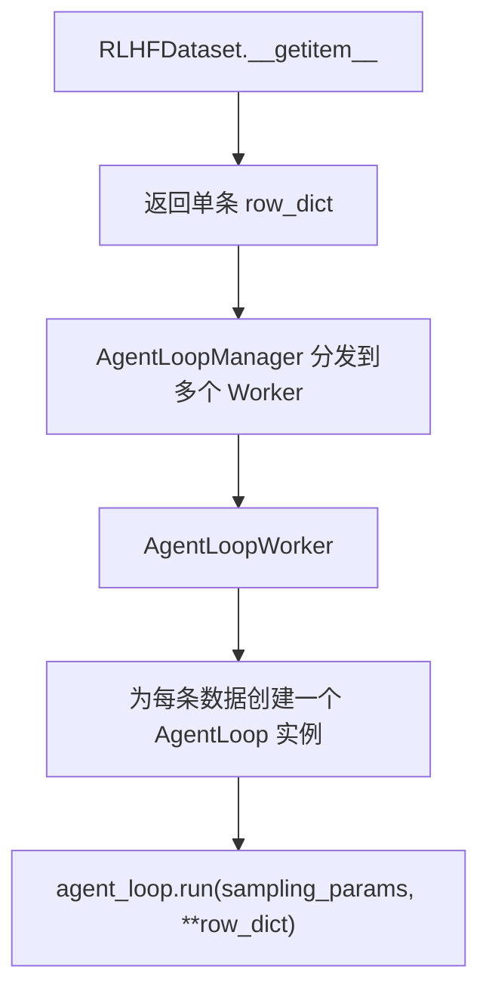
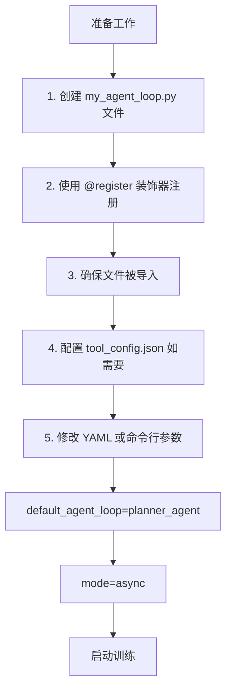
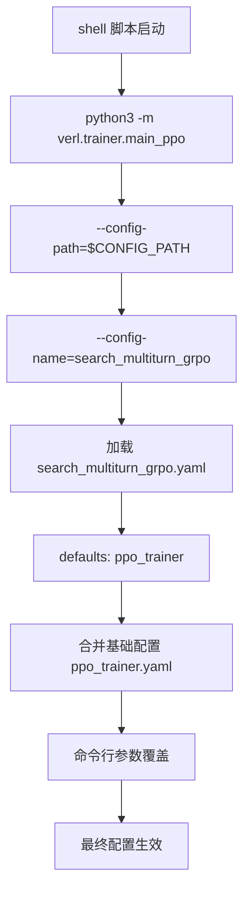
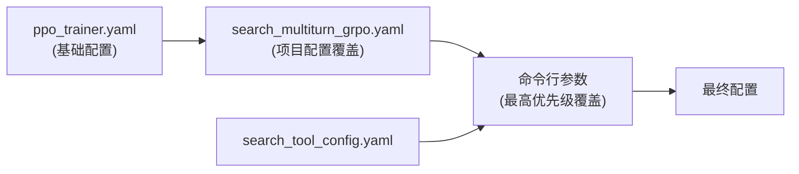
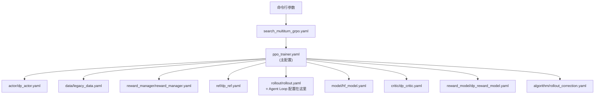
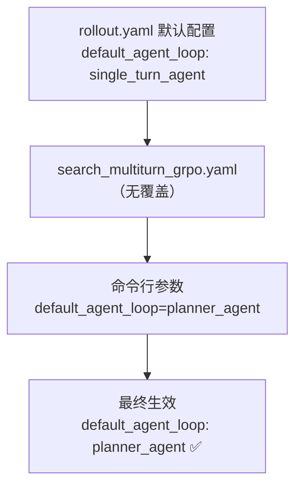

def fit(self):
    # 1. 加载检查点
    self._load_checkpoint()
    
    # 2. 训练循环
    for epoch in range(current_epoch, self.config.trainer.total_epochs):
        for batch_dict in self.train_dataloader:
            # 3. 生成序列（关键步骤！多轮工具调用在这里发生）
            gen_batch_output = self.actor_rollout_wg.generate_sequences(gen_batch_output)
            # 或者使用异步模式:
            # gen_batch_output = self.async_rollout_manager.generate_sequences(gen_batch_output)
            
            # 4. 计算奖励
            reward_tensor, reward_extra_infos_dict = compute_reward(batch, self.reward_fn)
            
            # 5. 计算各种概率和优势
            old_log_prob = self.actor_rollout_wg.compute_log_prob(batch)
            ref_log_prob = self.ref_policy_wg.compute_ref_log_prob(batch)
            values = self.critic_wg.compute_values(batch)
            batch = compute_advantage(batch, ...)
            
            # 6. 更新模型
            critic_output = self.critic_wg.update_critic(batch)
            actor_output = self.actor_rollout_wg.update_actor(batch)


# 让我查看 `RLHFDataset` 的数据格式，看看 `run` 方法接收的是什么样的数据。
[读取文件]
[查找文件]
现在我理解了！让我来回答你的问题：

---

## `run` 方法接收的数据格式

### 关键点：**不是一批次，是单条数据！**

根据我查看的代码，`run` 方法接收的 `**kwargs` 是 `RLHFDataset.__getitem__` 返回的**单条数据**，而不是一批次。

---

### 数据流转过程



从 `agent_loop.py` 第 227-238 行可以看到：

```python
@abstractmethod
async def run(self, sampling_params: dict[str, Any], **kwargs) -> AgentLoopOutput:
    """Run agent loop to interact with LLM server and environment.

    Args:
        sampling_params (Dict[str, Any]): LLM sampling params.
        **kwargs: dataset fields from `verl.utils.dataset.RLHFDataset`.  # <-- 单条数据！

    Returns:
        AgentLoopOutput: Agent loop output.
    """
```

---

### `kwargs` 包含的字段（单条数据）

根据 `RLHFDataset.__getitem__` 返回的 `row_dict`，`kwargs` 主要包含：

| 字段名 | 类型 | 说明 |
|--------|------|------|
| `input_ids` | `torch.Tensor` | Tokenized prompt IDs，形状 `(seq_len,)` |
| `attention_mask` | `torch.Tensor` | 注意力掩码，形状 `(seq_len,)` |
| `position_ids` | `torch.Tensor` | 位置 IDs |
| `raw_prompt_ids` | `list[int]` | 原始 prompt 的 token ids（可能被截断） |
| `raw_prompt` | `list[dict]` | **原始对话消息**（如果 `return_raw_chat=True`），格式如 `[{"role": "user", "content": "..."}]` |
| `full_prompts` | `str` | 应用 chat template 后的完整 prompt 字符串 |
| `multi_modal_data` | `dict` | 多模态数据，如 `{"image": [...], "video": [...]}` |
| `multi_modal_inputs` | `dict` | Processor 处理后的多模态输入 |
| `index` | `int` | 数据索引 |
| `tools_kwargs` | `dict` | 工具调用参数 |
| `interaction_kwargs` | `dict` | 交互参数 |
| `extra_info` | `dict` | 额外信息 |
| `data_source` | `str` | 数据来源标识 |

---

### 你代码中使用的关键字段

在你的 [my_agent_loop.py](/apdcephfs_szcf/share_303378293/hunyuan/eiraouyang/workplace/paper/verl/verl/experimental/agent_loop/my_agent_loop.py) 中：

```python
async def run(self, sampling_params: dict[str, Any], **kwargs) -> AgentLoopOutput:
    messages = list(kwargs["raw_prompt"])  # 原始对话消息，单条！
    # 格式：[{"role": "system", "content": "..."}, {"role": "user", "content": "用户问题"}]
```

---

### 批量处理是在哪里发生的？

批量处理发生在 `AgentLoopManager` 和 `AgentLoopWorker` 层面：

1. **`AgentLoopManager.generate_sequences`**：接收一个 batch
2. **分发给多个 `AgentLoopWorker`**：每个 worker 处理 batch 的一部分
3. **每个 `AgentLoopWorker`**：为 batch 中的每条数据**并发**创建一个 `AgentLoop` 实例
4. **每个 `AgentLoop.run`**：处理**单条数据**

```python
# 伪代码：AgentLoopWorker 的处理逻辑
async def process_batch(self, batch_data):
    tasks = []
    for single_item in batch_data:  # 遍历 batch 中的每条数据
        agent_loop = PlannerAgentLoop(...)
        task = agent_loop.run(sampling_params, **single_item)  # 单条数据！
        tasks.append(task)
    
    # 并发执行所有 agent loop
    results = await asyncio.gather(*tasks)
    return results
```

---

### 总结

| 问题 | 答案 |
|------|------|
| `run` 接收的是批次还是单条？ | **单条数据** |
| 数据格式来自哪里？ | `RLHFDataset.__getitem__` 返回的 `row_dict` |
| 批量处理在哪里？ | `AgentLoopWorker` 层面，通过 `asyncio` 并发处理多条数据 |
| `kwargs["raw_prompt"]` 是什么？ | 单条对话消息，如 `[{"role": "user", "content": "问题"}]` |


# 如何配置和使用 `PlannerAgentLoop`。

---

## 如何使用 `PlannerAgentLoop`

### 方式一：命令行配置（推荐）

在启动训练时，通过命令行参数指定使用你的自定义 agent loop：

```bash
python -m verl.trainer.main_ppo \
    ... 其他参数 ... \
    actor_rollout_ref.rollout.mode=async \
    actor_rollout_ref.rollout.agent.default_agent_loop=planner_agent
```

关键参数：
| 参数 | 值 | 说明 |
|------|-----|------|
| `rollout.mode` | `async` | **必须**使用异步模式 |
| `rollout.agent.default_agent_loop` | `planner_agent` | 对应你的 `@register("planner_agent")` |

---

### 方式二：修改 YAML 配置文件

修改你的训练配置文件（如 `_generated_ppo_trainer.yaml` 或你自己的配置文件）：

```yaml
actor_rollout_ref:
  rollout:
    mode: async  # 必须使用异步模式！
    
    # 工具配置
    multi_turn:
      tool_config_path: /path/to/your/tool_config.json  # 检索工具配置
    
    # Agent Loop 配置
    agent:
      num_workers: 8  # worker 数量
      default_agent_loop: planner_agent  # 使用你注册的 planner_agent
```

---

### 方式三：参考教程中的 Notebook 写法

从教程可以看到完整的配置示例：

```python
from hydra import compose, initialize_config_dir

with initialize_config_dir(config_dir=verl_config_dir):
    config = compose(
        config_name="ppo_trainer",
        overrides=[
            # ... 其他配置 ...
            
            # rollout 必须使用 async 模式
            "actor_rollout_ref.rollout.mode=async",
            
            # 指定工具配置文件（如果需要检索工具）
            "actor_rollout_ref.rollout.multi_turn.tool_config_path=" + tool_config_path,
            
            # 指定使用你的 planner_agent
            "actor_rollout_ref.rollout.agent.default_agent_loop=planner_agent",
        ],
    )
```

---

### 重要：确保你的文件被导入

由于你使用了 `@register("planner_agent")` 装饰器，**你需要确保这个文件被导入**，这样 register 才会执行。

有两种方法：

#### 方法 A：在 `__init__.py` 中导入（推荐）

修改 `/verl/experimental/agent_loop/__init__.py`，添加：

```python
from verl.experimental.agent_loop.my_agent_loop import PlannerAgentLoop
```

#### 方法 B：使用 `agent_loop_config_path` 配置

创建一个 `agent_loop_config.yaml` 文件：

```yaml
- name: planner_agent
  _target_: verl.experimental.agent_loop.my_agent_loop.PlannerAgentLoop
```

然后在训练配置中指定：

```yaml
actor_rollout_ref:
  rollout:
    agent:
      agent_loop_config_path: /path/to/agent_loop_config.yaml
```

---

### 配置检索工具（如果需要）

你的代码中使用了 `self._call_retrieval_tool`，需要配置一个检索工具。创建 `tool_config.json`：

```json
{
  "tools": [
    {
      "class_name": "your_module.RetrievalTool",
      "config": {
        "type": "native",
        "api_url": "http://your-retrieval-service/search"
      }
    }
  ]
}
```

---

### 完整启动命令示例

```bash
python -m verl.trainer.main_ppo \
    data.train_files=/path/to/train.parquet \
    data.val_files=/path/to/val.parquet \
    data.return_raw_chat=True \
    actor_rollout_ref.model.path=/path/to/your/model \
    actor_rollout_ref.rollout.mode=async \
    actor_rollout_ref.rollout.multi_turn.tool_config_path=/path/to/tool_config.json \
    actor_rollout_ref.rollout.agent.default_agent_loop=planner_agent \
    trainer.n_gpus_per_node=8
```

---

### 流程总结图



---

### 验证是否生效

启动训练后，在日志中你应该能看到类似：
```
Using agent loop: planner_agent
```

或者在你的代码中添加日志：

```python
async def run(self, sampling_params: dict[str, Any], **kwargs) -> AgentLoopOutput:
    print(f"[PlannerAgentLoop] Processing query: {kwargs.get('raw_prompt', [])[-1]}")
    # ... 你的逻辑
```


让我帮你查看这个 shell 脚本是如何加载配置的：
[读取文件]
现在让我查看配置文件 `search_multiturn_grpo.yaml` 的具体内容：
[读取文件]
现在我完全理解了配置的工作方式。让我为你详细解释：

---

## 配置文件是如何在 shell 脚本中生效的

### 配置加载机制

这个训练脚本使用 **Hydra** 配置框架，配置生效的流程如下：



### 配置层级（优先级从低到高）

| 优先级 | 来源 | 示例 |
|--------|------|------|
| 1 (最低) | 基础配置 `ppo_trainer.yaml` | `verl/trainer/config/ppo_trainer.yaml` |
| 2 | 项目配置 `search_multiturn_grpo.yaml` | 覆盖基础配置中的部分值 |
| 3 (最高) | **命令行参数** | 直接在 shell 脚本中指定 |

---

### 你的 `planner_agent` 是如何生效的

在你的 shell 脚本中，这一行就是**让 `planner_agent` 生效的关键**：

```bash
actor_rollout_ref.rollout.agent.default_agent_loop=planner_agent \
```
# Hydra 的命令行覆盖机制
通过 Hydra 的命令行覆盖机制实现的，它会：
1. 覆盖配置中 `actor_rollout_ref.rollout.agent.default_agent_loop` 的值
2. 设置为你注册的 `planner_agent`

---

### 完整的配置关系图

```
shell 脚本中的参数
         │
         ▼
┌─────────────────────────────────────────────────────────┐
│  --config-path="$PROJECT_DIR/examples/sglang_multiturn/config"  │
│  --config-name='search_multiturn_grpo'                         │
└─────────────────────────────────────────────────────────┘
         │
         ▼
┌────────────────────────────────────────┐
│ search_multiturn_grpo.yaml             │
│ ├─ defaults:                           │
│ │   └─ ppo_trainer  ◄─────────────────┼──── 继承基础配置
│ │   └─ _self_                          │
│ ├─ data: ...                           │
│ └─ actor_rollout_ref:                  │
│     └─ rollout:                        │
│         └─ multi_turn:                 │
│             └─ enable: True            │
└────────────────────────────────────────┘
         │
         ▼  (命令行参数覆盖)
┌────────────────────────────────────────────────────────────────┐
│ actor_rollout_ref.rollout.agent.default_agent_loop=planner_agent│  ◄─ 你的关键配置！
│ actor_rollout_ref.rollout.multi_turn.tool_config_path="$TOOL_CONFIG" │
│ ... 其他命令行参数 ...                                            │
└────────────────────────────────────────────────────────────────┘
```

---

### 你的脚本已经配置好了！

从你的脚本可以看到，**你已经正确配置了 `planner_agent`**：

```bash
# 已存在的关键配置
actor_rollout_ref.rollout.agent.default_agent_loop=planner_agent \   # ✅ 使用你的 agent
actor_rollout_ref.rollout.multi_turn.enable=True \                    # ✅ 启用多轮
actor_rollout_ref.rollout.multi_turn.tool_config_path="$TOOL_CONFIG" \ # ✅ 工具配置
actor_rollout_ref.rollout.name=sglang \                               # ✅ 使用 sglang
```

---

### 还需要做的一件事：确保导入

为了让 `@register("planner_agent")` 生效，你需要确保文件被导入。查看一下 `__init__.py`：
[读取文件]
你需要在 `__init__.py` 中添加你的 `PlannerAgentLoop` 导入，这样注册才能生效：
[编辑文件]
现在我来总结一下配置是如何生效的：

---

## 完整总结：配置如何生效

### 1. 配置加载流程

```
┌─────────────────────────────────────────────────────────────────┐
│                    run_qwen2.5-3b_instruct_search_multiturn.sh  │
└─────────────────────────────────────────────────────────────────┘
                                │
                                ▼
┌─────────────────────────────────────────────────────────────────┐
│  python3 -m verl.trainer.main_ppo                               │
│    --config-path="$PROJECT_DIR/examples/sglang_multiturn/config"│
│    --config-name='search_multiturn_grpo'                        │
│    actor_rollout_ref.rollout.agent.default_agent_loop=planner_agent │  ◄─ 命令行覆盖
└─────────────────────────────────────────────────────────────────┘
                                │
                                ▼
┌─────────────────────────────────────────────────────────────────┐
│  Hydra 配置系统                                                  │
│  1. 加载 verl/trainer/config/ppo_trainer.yaml（基础配置）         │
│  2. 加载 search_multiturn_grpo.yaml（项目配置，覆盖基础配置）      │
│  3. 应用命令行参数（最高优先级，覆盖前两者）                       │
└─────────────────────────────────────────────────────────────────┘
                                │
                                ▼
┌─────────────────────────────────────────────────────────────────┐
│  最终配置中：                                                    │
│  actor_rollout_ref.rollout.agent.default_agent_loop = "planner_agent" │
└─────────────────────────────────────────────────────────────────┘
                                │
                                ▼
┌─────────────────────────────────────────────────────────────────┐
│  AgentLoopManager 初始化时：                                     │
│  根据 "planner_agent" 在注册表中查找对应的类                      │
│  找到 PlannerAgentLoop（通过 @register("planner_agent") 注册）    │
└─────────────────────────────────────────────────────────────────┘
```

### 2. 你已完成的配置（在 shell 脚本中）

| 配置项 | 值 | 作用 |
|--------|-----|------|
| `actor_rollout_ref.rollout.agent.default_agent_loop` | `planner_agent` | 使用你的 PlannerAgentLoop |
| `actor_rollout_ref.rollout.multi_turn.enable` | `True` | 启用多轮对话 |
| `actor_rollout_ref.rollout.multi_turn.tool_config_path` | `$TOOL_CONFIG` | 检索工具配置 |
| `actor_rollout_ref.rollout.name` | `sglang` | 使用 SGLang 推理引擎 |

### 3. 我刚帮你添加的导入（让 register 生效）

修改了 `/verl/experimental/agent_loop/__init__.py`：
```python
from .my_agent_loop import PlannerAgentLoop
_ = [SingleTurnAgentLoop, ToolAgentLoop, PlannerAgentLoop]  # 触发注册
```

### 4. 现在可以运行了

```bash
cd /apdcephfs_szcf/share_303378293/hunyuan/eiraouyang/workplace/paper/verl
bash examples/sglang_multiturn/search_r1_like/run_qwen2.5-3b_instruct_search_multiturn.sh
```


---

## Shell 脚本中调用的所有 YAML 文件路径

### 1. 主配置文件（Hydra 配置）

| 配置项 | 路径 |
|--------|------|
| `--config-path` | `$PROJECT_DIR/examples/sglang_multiturn/config` |
| `--config-name` | `search_multiturn_grpo` |

**实际完整路径**：
```
/apdcephfs_szcf/share_303378293/hunyuan/eiraouyang/workplace/paper/verl/examples/sglang_multiturn/config/search_multiturn_grpo.yaml
```

---

### 2. 工具配置文件

| 变量 | 路径 |
|------|------|
| `$TOOL_CONFIG` | `$CONFIG_PATH/tool_config/search_tool_config.yaml` |

**实际完整路径**：
```
/apdcephfs_szcf/share_303378293/hunyuan/eiraouyang/workplace/paper/verl/examples/sglang_multiturn/config/tool_config/search_tool_config.yaml
```

---

### 3. 隐式引用的基础配置（通过 Hydra defaults 继承）

由于 `search_multiturn_grpo.yaml` 中有 `defaults: [ppo_trainer]`，会自动加载：

```
/apdcephfs_szcf/share_303378293/hunyuan/eiraouyang/workplace/paper/verl/verl/trainer/config/ppo_trainer.yaml
```

---

## 总结：所有 YAML 文件路径一览

```
📁 直接引用的 YAML 文件
├── /apdcephfs_szcf/.../verl/examples/sglang_multiturn/config/search_multiturn_grpo.yaml   ← 主配置
└── /apdcephfs_szcf/.../verl/examples/sglang_multiturn/config/tool_config/search_tool_config.yaml   ← 工具配置

📁 间接继承的 YAML 文件（通过 defaults）
└── /apdcephfs_szcf/.../verl/verl/trainer/config/ppo_trainer.yaml   ← 基础 PPO 配置
```

---

### 配置加载顺序



我来帮你查看 `ppo_trainer.yaml` 是否会调用其他 YAML 配置：
[读取文件]
是的！`ppo_trainer.yaml` 通过 **Hydra 的 `defaults` 机制** 调用了多个其他 YAML 配置文件。让我为你整理：

---

## `ppo_trainer.yaml` 调用的所有 YAML 配置

从文件的 `defaults` 部分可以看到，它引用了 **9 个子配置文件**：

| 序号 | defaults 语法 | 实际加载的 YAML 文件路径 | 作用 |
|------|--------------|------------------------|------|
| 1 | `actor@actor_rollout_ref.actor: dp_actor` | `verl/trainer/config/actor/dp_actor.yaml` | Actor 模型配置 |
| 2 | `data@data: legacy_data` | `verl/trainer/config/data/legacy_data.yaml` | 数据加载配置 |
| 3 | `reward_manager@reward_manager` | `verl/trainer/config/reward_manager/reward_manager.yaml` | 奖励管理器配置 |
| 4 | `ref@actor_rollout_ref.ref: dp_ref` | `verl/trainer/config/ref/dp_ref.yaml` | Reference 模型配置 |
| 5 | `rollout@actor_rollout_ref.rollout: rollout` | `verl/trainer/config/rollout/rollout.yaml` | **Rollout 配置（Agent Loop 相关！）** |
| 6 | `model@actor_rollout_ref.model: hf_model` | `verl/trainer/config/model/hf_model.yaml` | HuggingFace 模型配置 |
| 7 | `critic@critic: dp_critic` | `verl/trainer/config/critic/dp_critic.yaml` | Critic 模型配置 |
| 8 | `reward_model@reward_model: dp_reward_model` | `verl/trainer/config/reward_model/dp_reward_model.yaml` | 奖励模型配置 |
| 9 | `algorithm@algorithm.rollout_correction: rollout_correction` | `verl/trainer/config/algorithm/rollout_correction.yaml` | 算法修正配置 |

---

## 配置继承关系图



---

## 重点：与你的 `PlannerAgentLoop` 相关的配置

你的 **Agent Loop 配置** 主要在 `rollout/rollout.yaml` 中：

```
verl/trainer/config/rollout/rollout.yaml
```

这个文件应该包含：
- `agent.default_agent_loop` - Agent Loop 类型
- `multi_turn` - 多轮对话配置
- `mode` - rollout 模式（async/sync）

你在命令行中的配置：
```bash
actor_rollout_ref.rollout.agent.default_agent_loop=planner_agent
```
就是**覆盖** `rollout.yaml` 中的默认值。

---

## 完整目录结构

```
verl/trainer/config/
├── ppo_trainer.yaml          ← 主配置（你问的这个）
├── actor/
│   └── dp_actor.yaml         ← Actor 配置
├── data/
│   └── legacy_data.yaml      ← 数据配置
├── reward_manager/
│   └── reward_manager.yaml   ← 奖励管理器
├── ref/
│   └── dp_ref.yaml           ← Reference 模型
├── rollout/
│   └── rollout.yaml          ← ⭐ Rollout 配置（Agent Loop）
├── model/
│   └── hf_model.yaml         ← 模型配置
├── critic/
│   └── dp_critic.yaml        ← Critic 配置
├── reward_model/
│   └── dp_reward_model.yaml  ← 奖励模型
└── algorithm/
    └── rollout_correction.yaml ← 算法修正
```

---

## 如果你想查看 Agent Loop 的默认配置

你可以查看 `rollout/rollout.yaml` 文件，看看 `agent` 部分的默认配置是什么。需要我帮你读取吗？


## `rollout.yaml` 中 Agent 部分的默认配置

从文件的 **第 210-247 行** 可以看到 `agent` 配置：

```yaml
# [Experimental] agent loop based rollout configs
agent:

  # Required when using verl.utils.omega_conf_to_dataclass to instantiate dataclass configs
  _target_: verl.workers.config.AgentLoopConfig

  # Number of agent loop workers
  num_workers: 8

  # default agent loop to use if `agent_name` not set in RL dataset
  default_agent_loop: single_turn_agent   # ← 默认值！

  # custom agent loop config path
  agent_loop_config_path: null

  # custom async server configs
  custom_async_server:
    _target_: verl.workers.config.CustomAsyncServerConfig
    path: null
    name: null
```

---

## 关键配置项解释

| 配置项 | 默认值 | 说明 |
|--------|--------|------|
| `num_workers` | `8` | Agent Loop Worker 的数量，控制并发处理的请求数 |
| `default_agent_loop` | `single_turn_agent` | **默认使用 `single_turn_agent`**，你需要改成 `planner_agent` |
| `agent_loop_config_path` | `null` | 自定义 agent loop 配置文件路径 |
| `custom_async_server.path` | `null` | 自定义异步服务器实现路径 |
| `custom_async_server.name` | `null` | 自定义异步服务器类名 |

---

## 与你的 `PlannerAgentLoop` 相关

你在 shell 脚本中的配置：
```bash
actor_rollout_ref.rollout.agent.default_agent_loop=planner_agent
```

**就是覆盖这里的默认值** `single_turn_agent` → `planner_agent`

---

## 内置的 Agent Loop 类型

根据框架的注册机制，内置了以下 Agent Loop：

| 注册名 | 类 | 说明 |
|--------|-----|------|
| `single_turn_agent` | `SingleTurnAgentLoop` | 单轮对话（默认） |
| `tool_agent` | `ToolAgentLoop` | 多轮工具调用 |
| `planner_agent` | `PlannerAgentLoop` | **你自定义的**（问题分解 + 检索 + 推理） |

---

## 配置覆盖关系图



---

## 关于 `agent_loop_config_path` 的用法

如果你想用 YAML 文件配置而不是命令行参数，可以创建一个配置文件：

```yaml
# custom_agent_loops.yaml
- name: planner_agent
  _target_: verl.experimental.agent_loop.my_agent_loop.PlannerAgentLoop
  # 可以在这里添加自定义参数
  max_sub_questions: 5
  retrieval_top_k: 3
```

然后在命令行指定：
```bash
actor_rollout_ref.rollout.agent.agent_loop_config_path=/path/to/custom_agent_loops.yaml
```

---

## 总结

你的配置是**正确的**！只需要：
1. ✅ 在命令行中指定 `default_agent_loop=planner_agent`
2. ✅ 确保 `PlannerAgentLoop` 已通过 `@register("planner_agent")` 注册
3. ✅ 确保文件被导入（已在 `__init__.py` 中添加）
